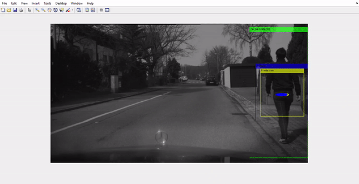

# KalmanFilter-PeopleTracker

## Description

Implementation of the Kalman Filter in order to track people in a sequence of frames (video).

It can be seen in the video:
* A green box which contains the position where the HOG detector has detected a person
* A yellow box which contains the position where the KF predicts the position of a person
* A yellow ellipse which indicates the uncertainty of the KF prediction, i.e. the error the KF could take in its prediction.
* A blue box which contains the position where the KF updates (prediction + measure) the position of a person.
* A blue ellipse which indicates the uncertainty of the KF update, i.e. the error the KF could take in its update.

If the KF has no measures from the HOG detector then uncertainty ellipses will increase more and more.

Please, see the result in below gif:

## Author

[Marcos Canales Mayo](https://github.com/MarcosCM)

``plotUncertainEllip2D.m`` by **Javier Civera** -- jcivera@unizar.es and **J. M. M. Montiel** -- josemari@unizar.es

If you use this code for academic work, please reference:
* Javier Civera, Oscar G. Grasa, Andrew J. Davison, J. M. M. Montiel
